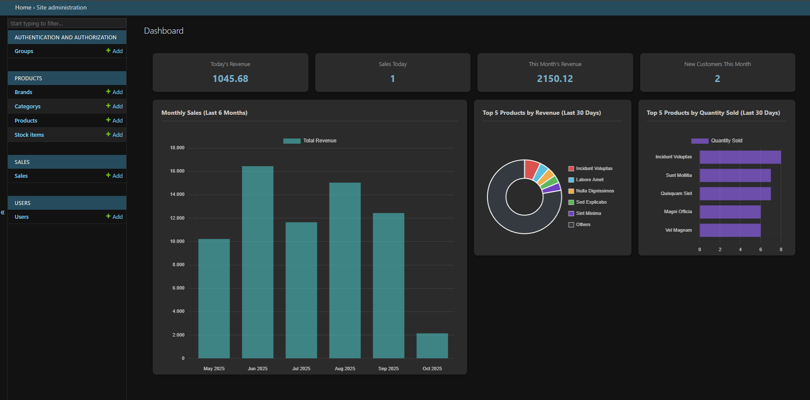
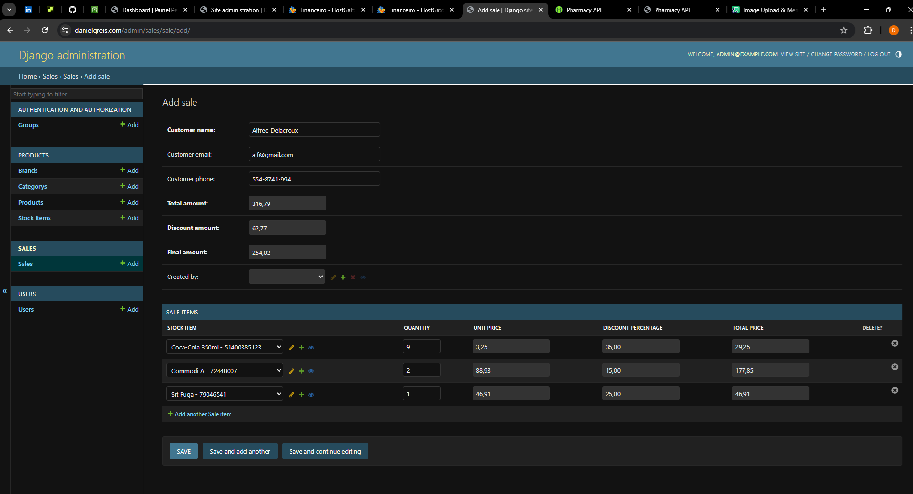

# Pharmacy API

A comprehensive pharmacy management system API built with Django REST Framework, designed with enterprise-level standards for quality, security, and maintainability.

---

## Live Demo on AWS

This project is fully deployed on a production-ready AWS infrastructure. You can explore the live application using the links below.

* **Admin Interface:** **[https://danielqreis.com/admin/](https://danielqreis.com/admin/)**
* **Swagger UI API Docs:** **[https://danielqreis.com/api/v1/schema/swagger-ui/](https://danielqreis.com/api/v1/schema/swagger-ui/)**
* **ReDoc API Docs:** **[https://danielqreis.com/api/v1/schema/redoc/](https://danielqreis.com/api/v1/schema/redoc/)**

A test user with limited permissions has been created for recruiters to explore the admin panel. This user can view, add, and change data, but is restricted from deleting records.

* **Email:** `user@user.com`
* **Password:** `user1234`

### Project Showcase

**Custom Django Admin Dashboard with Real-Time Analytics**


**Interactive Sales Form with Autocomplete and Dynamic Calculations**


---

## Features

- **Robust Architecture**: Built on Clean Architecture principles with a dedicated Service Layer and Data Transfer Objects (DTOs) to ensure separation of concerns.
- **User Authentication**: Secure JWT-based authentication for the API and a session-based admin interface.
- **Product Management**: Complete CRUD for brands, categories, products, and stock items.
- **Sales Management**: Transactional sales creation with automatic stock updates and dynamic discount calculations.
- **Inventory Tracking**: Real-time inventory management with expiration date tracking.
- **Advanced Reporting**: A custom admin dashboard with Chart.js and dedicated API endpoints for financial insights.
- **High Performance**: Caching strategies with Redis to optimize frequent queries.
- **Asynchronous Tasks**: Celery and Redis for handling background processes and scheduled tasks.
- **Comprehensive Testing**: Full test suite covering unit, integration, and service layers using `pytest` and `factory-boy`.
- **Automated Quality & Security**: CI/CD pipeline with GitHub Actions that runs linters (`ruff`), static type checking (`mypy --strict`), and security scanning (`bandit`).
- **Interactive API Documentation**: Auto-generated, interactive API documentation with Swagger UI and ReDoc via `drf-spectacular`.
- **Professional Deployment**: Deployed on AWS (EC2) with Docker, Nginx, Gunicorn, PostgreSQL, Redis, and S3 for static files, all secured with HTTPS/SSL.

## Tech Stack

- **Backend**: Django 4.2, Django REST Framework
- **Database**: PostgreSQL
- **Authentication**: JWT (djangorestframework-simplejwt)
- **Caching & Task Queues**: Redis
- **Background Tasks**: Celery
- **API Documentation**: drf-spectacular
- **Testing**: pytest, factory-boy, Faker
- **Code Quality**: `black`, `ruff`, `mypy`, `pre-commit`, `bandit`
- **Deployment**: Docker, Docker Compose, Gunicorn, Nginx, AWS (EC2, S3), Let's Encrypt

---

## Getting Started with Docker (Local Development)

This is the recommended method for running the project locally, as it provides a consistent environment. The project uses a base `docker-compose.yml` and a development-specific `docker-compose.override.yml`.

### Prerequisites

- Docker
- Docker Compose (v2 recommended)

### Automated Setup (Recommended)

A single script will build the containers, run database migrations, create a default superuser, and seed the database with sample data.

1.  **Clone the repository:**
    ```bash
    git clone [https://github.com/Daniel-Q-Reis/drugstore_api.git](https://github.com/Daniel-Q-Reis/drugstore_api.git)
    cd drugstore_api
    ```

2.  **Create your local environment files:**
    This project requires a `.env` file for environment variables and a `docker-compose.override.yml` for development-specific settings. Copy the provided examples to create them.
    ```bash
    # For Unix/Linux/Mac
    cp .env.example .env && cp docker-compose.override.yml.example docker-compose.override.yml
    ```
    ```bat
    # For Windows
    copy .env.example .env
    copy docker-compose.override.yml.example docker-compose.override.yml
    ```
    *(You can customize variables inside `.env` if needed, but the defaults work out-of-the-box for local setup.)*

3.  **Run the setup script:**
    -   On **Unix/Linux/Mac**:
        ```bash
        scripts/run_docker.sh
        ```
    -   On **Windows**:
        ```bat
        scripts\run_docker.bat
        ```

This process will execute the `setup_project` command, which:
-   Applies all database migrations.
-   Creates a default superuser.
    -   **Email**: `admin@example.com`
    -   **Password**: `admin123`
-   Seeds the database with a generous amount of sample data. To run the setup *without* seeding, execute: `docker-compose exec app python manage.py setup_project --no-seed`.

#### 2. Day-to-Day Development (99% of the time)

-   **To start your environment:**
    -   Windows: `scripts\start_dev.bat`
    -   Unix/Linux/Mac: `./scripts/start_dev.sh`

-   **To stop your environment:**
    -   Windows: `scripts\stop_dev.bat`
    -   Unix/Linux/Mac: `./scripts/stop_dev.sh`

While the environment is running with `start_dev`, any changes you make to your Python files will automatically reload the server, thanks to the volume mapping in `docker-compose.override.yml`. Just save your file and refresh your browser.

### Manual Setup (For More Control)

If you prefer to run each step manually after setting up the `.env` and `override` files:

1.  **Build and start the services:**
    ```bash
    docker-compose up --build -d
    ```
2.  **Run migrations:**
    ```bash
    docker-compose exec app python manage.py migrate
    ```
3.  **Create a superuser:**
    ```bash
    docker-compose exec app python manage.py createsuperuser_if_none_exists
    ```
4.  **(Optional) Seed the database:**
    ```bash
    docker-compose exec app python manage.py seed_db
    ```

### Accessing the Application

Once the application is running, the following endpoints will be available:

-   **Django Admin**: `http://localhost:8000/admin`
    -   *Login with the superuser credentials (`admin@example.com` / `admin123`)*.

-   **API Documentation (Swagger UI)**: `http://localhost:8000/api/v1/schema/swagger-ui/`
    -   *The best place to explore and test the API endpoints interactively.*

-   **API Documentation (ReDoc)**: `http://localhost:8000/api/v1/schema/redoc/`
    -   *Alternative documentation view.*

-   **API Base Path**: `http://localhost:8000/api/v1/`
    -   *Note: This is the base prefix for all API endpoints (e.g., `/api/v1/products/`, `/api/v1/sales/`). It does not have a user interface and will show a 404 error if accessed directly in a browser.*

To shut down the services, run: `docker-compose down`. For a clean shutdown that also removes the database volume, use `docker-compose down -v`.

---

###  Testing & Code Quality

This project is configured with a strict set of quality gates to ensure code is reliable and maintainable.

#### Running Tests

The test suite is designed to be run inside the Docker container to ensure a consistent environment with access to the database.

1.  **Ensure your Docker containers are running:**
    ```bash
    docker-compose up -d
    ```

2.  **Execute the test suite:**
    ```bash
    docker-compose exec app pytest
    ```

3.  **To generate a detailed coverage report:**
    ```bash
    docker-compose exec app pytest --cov=. --cov-report=html
    ```
    *You can then open the `htmlcov/index.html` file in your browser to view the interactive report.*

---
**Note for Local Development (Advanced):** If you are running a local PostgreSQL server (not in Docker) and have activated the local virtual environment (`venv`), you must first switch your settings to point to `localhost`. Run the script `scripts\use_local_settings.bat` (Windows) or `scripts/use_local_settings.sh` (Unix/Linux) before running `pytest`.

#### Code Quality Checks
The project uses `pre-commit` to automate quality checks before every commit. To run all checks manually across the entire codebase:

```bash
pre-commit run --all-files
```

This will execute the following tools:

black: For uncompromising code formatting.

ruff: An extremely fast linter for identifying potential bugs and style issues.

mypy: A static type checker running in strict mode to enforce type safety.

bandit: A security scanner to find common security vulnerabilities.


##Project Structure

```bash
pharmacy_api/
├── apps/
│   ├── core/          # Core app with management commands
│   ├── users/         # User management and authentication
│   ├── products/      # Product and inventory management
│   ├── sales/         # Sales and transaction management
│   └── reports/       # Reporting and analytics
├── pharmacy_api/      # Main project settings and configuration
├── scripts/           # Setup and utility scripts
└── requirements.txt   # Python dependencies
```

##License & Contact

This project is licensed under the MIT License.

Author: Daniel de Queiroz Reis

Email: danielqreis@gmail.com

WhatsApp: +55 35 99190-2471